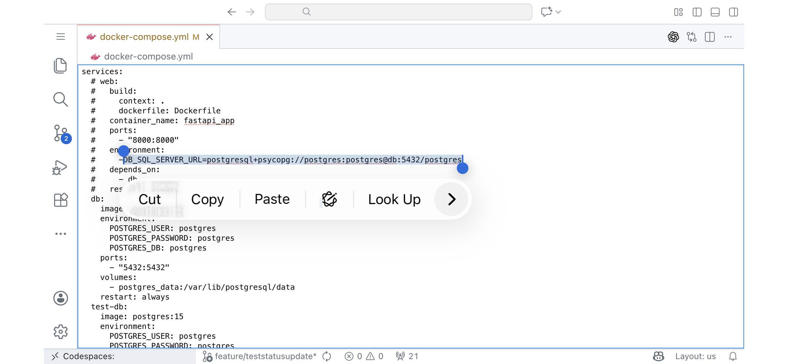

# native-editor

**native-editor** is a lightweight VS Code custom editor that replaces the default editor with a simple HTML `<textarea>` rendered inside a Webview. It supports all text-based files and works in VS Code Desktop, Web, and GitHub Codespaces. This extension provides a native editing experience for VS Code. It is designed to be lightweight and efficient, making it ideal for use on small mobile devices like iPhone or Android. On iOS, you can use touch to select text spans, copy, paste, and perform other editing actions.

## Features

- Custom Webview-based text editor using a native HTML `<textarea>`
- Automatically resizes to fill the entire editor panel
- Two-way syncing between the textarea and the underlying document
- Supports all text files via `"*"` filename matching
- Fully compatible with Codespaces and VS Code Web (no Node.js filesystem APIs)

## Extension Settings

This extension does not add any new configuration settings.

## Known Issues

- Not optimized for very large files  
- No advanced editing features (syntax highlighting, multi-cursor, undo manager)  
- Binary files are not detected and may display unreadable content

## Release Notes

### 0.0.1

- Initial release  
- Textarea-based custom editor  
- Auto-resizing layout  
- Two-way document sync  
- Supports all file extensions  
- Works in Codespaces and VS Code Web
